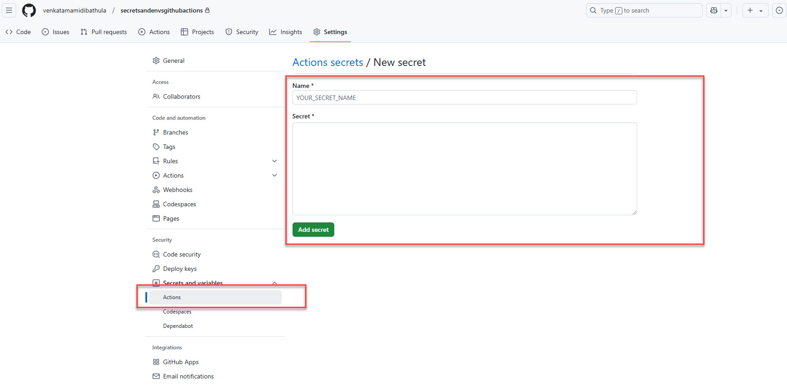
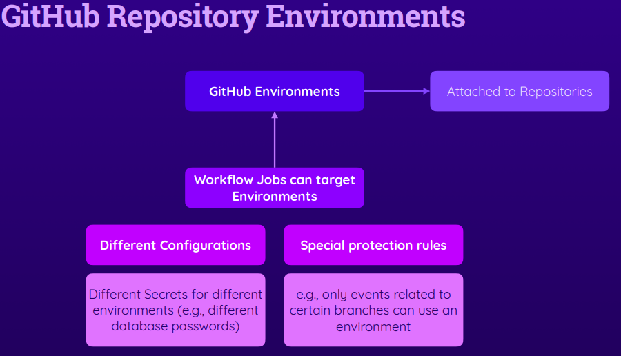

# GItHubActions
GitHub Actions Repository

**Upload and Deploy Artifacts**


```yaml

name: Deploy website
on:
  push:
    branches:
      - main
  workflow_dispatch:
jobs:
  test:
    runs-on: ubuntu-latest
    steps:
      - name: Get code
        uses: actions/checkout@v3
      - name: Install dependencies
        run: npm ci
      - name: Lint code
        run: npm run lint
      - name: Test code
        run: npm run test
  build:
    needs: test
    runs-on: ubuntu-latest
    steps:
      - name: Get code
        uses: actions/checkout@v3
      - name: Install dependencies
        run: npm ci
      - name: Build website
        run: npm run build
      - name: upload to artifactory
        uses: actions/upload-artifact@v4
        with:
          name: dist-files
          path: |
            dist
  deploy:
    needs: build
    runs-on: ubuntu-latest
    steps:
      - name: Downloading artifacts
        uses: actions/download-artifact@v4
        with:
          name: dist-files
      - name: Output contents
        run: ls
      - name: Deploy
        run: echo "Deploying..."


```
---

**Outputs**

Outputs are published values that can be used for other jobs.


**$GITHUB_OUTPUT**: It targets a special file created by GITHUB in environment which job runs where output key value pair is written to.


```yaml

name: Deploy website
on:
  push:
    branches:
      - main
  workflow_dispatch:
jobs:
  test:
    runs-on: ubuntu-latest
    steps:
      - name: Get code
        uses: actions/checkout@v3
      - name: Install dependencies
        run: npm ci
      - name: Lint code
        run: npm run lint
      - name: Test code
        run: npm run test
  build:
    needs: test
    runs-on: ubuntu-latest
    outputs:
      script-file: ${{ steps.publish.outputs.filename }} #steps.id.outputs.outputname
    steps:
      - name: Get code
        uses: actions/checkout@v3
      - name: Install dependencies
        run: npm ci
      - name: Build website
        run: npm run build
      - name: Publish JS filename
        id: publish
        run: find dist/assets/*.js -type f -execdir echo 'filename={}' >> $GITHUB_OUTPUT ';' #It targets a special file created by GITHUB in environment which job runs where output key value pair is written to.
      - name: upload to artifactory
        uses: actions/upload-artifact@v4
        with:
          name: dist-files
          path: |
            dist
  deploy:
    needs: build
    runs-on: ubuntu-latest
    steps:
      - name: Downloading artifacts
        uses: actions/download-artifact@v4
        with:
          name: dist-files
      - name: Output contents
        run: ls
      - name: Deploy
        run: echo "Deploying..."

```

**Using output variables in other jobs**

**Syntax**: needs.build.output.script-file

```yaml
name: Deploy website
on:
  push:
    branches:
      - main
  workflow_dispatch:
jobs:
  test:
    runs-on: ubuntu-latest
    steps:
      - name: Get code
        uses: actions/checkout@v3
      - name: Install dependencies
        run: npm ci
      - name: Lint code
        run: npm run lint
      - name: Test code
        run: npm run test
  build:
    needs: test
    runs-on: ubuntu-latest
    outputs:
      script-file: ${{ steps.publish.outputs.filename }} #steps.id.outputs.outputname
    steps:
      - name: Get code
        uses: actions/checkout@v3
      - name: Install dependencies
        run: npm ci
      - name: Build website
        run: npm run build
      - name: Publish JS filename
        id: publish
        run: find dist/assets/*.js -type f -execdir echo 'filename={}' >> $GITHUB_OUTPUT ';' #It targets a special file created by GITHUB in environment which job runs where output key value pair is written to.
      - name: upload to artifactory
        uses: actions/upload-artifact@v4
        with:
          name: dist-files
          path: |
            dist
  deploy:
    needs: build
    runs-on: ubuntu-latest
    steps:
      - name: Downloading artifacts
        uses: actions/download-artifact@v4
        with:
          name: dist-files
      - name: Output contents
        run: ls
      - name: Deploy
        run: echo "Deploying..."
      - name: Output filename
        run: echo "${{ needs.build.outputs.script-file }}"
```

---

**Caching Dependencies**

- Dependencies can be centrally cached which aid in fast job executions.
- If dependencies are not cached the jobs will have reinstall all dependencies potentially causing delays.

- Action to be used **actions/cache@v3** and key should be a dynamic value which uses a special variable in github called **deps-node-modules-{{ hashFiles(****'/package-lock.json') }}**

```yaml


name: Deploy website
on:
  push:
    branches:
      - main
  workflow_dispatch:
jobs:
  test:
    runs-on: ubuntu-latest
    steps:
      - name: Get code
        uses: actions/checkout@v3
      - name: cache dependencies
        uses: actions/cache@v3
        with:
          path: ~/.npm
          key: deps-node-modules-${{ hashFiles('**/package-lock.json') }}
          #used for retrieving the cache and be used by the runner machine and also for discarding and the value is a dynamic value
      - name: Install dependencies
        run: npm ci
      - name: Lint code
        run: npm run lint
      - name: Test code
        run: npm run test
  build:
    needs: test
    runs-on: ubuntu-latest
    outputs:
      script-file: ${{ steps.publish.outputs.filename }} #steps.id.outputs.outputname
    steps:
      - name: Get code
        uses: actions/checkout@v3
      - name: cache dependencies
        uses: actions/cache@v3
        with:
          path: ~/.npm
          key: deps-node-modules-${{ hashFiles('**/package-lock.json') }}
      - name: Install dependencies
        run: npm ci
      - name: Build website
        run: npm run build
      - name: Publish JS filename
        id: publish
        run: find dist/assets/*.js -type f -execdir echo 'filename={}' >> $GITHUB_OUTPUT ';' #It targets a special file created by GITHUB in environment which job runs where output key value pair is written to.
      - name: upload to artifactory
        uses: actions/upload-artifact@v4
        with:
          name: dist-files
          path: |
            dist
  deploy:
    needs: build
    runs-on: ubuntu-latest
    steps:
      - name: Downloading artifacts
        uses: actions/download-artifact@v4
        with:
          name: dist-files
      - name: Output contents
        run: ls
      - name: Deploy
        run: echo "Deploying..."
      - name: Output filename
        run: echo "${{ needs.build.outputs.script-file }}"

```

---

**Environment Variables**

You can define environment variables at **job** level or **workflow level** and reference them in your github yaml using the parameter ${{ env.variable }}

However, this approach is not advisable as it can lead to exposing them on repo and for that reason we have to use the secrets configuration.

```yaml


name: Deployment
on:
  push:
    branches:
      - develop
      - master
jobs:
  test:
    env:
      MONGODB_CLUSTER_ADDRESS: cluster0.kka04.mongodb.net
      MONGODB_USERNAME: mongouser
      MONGODB_PASSWORD: FMUW0JGcqtDcD8dM
      PORT: 8080
    runs-on: ubuntu-latest
    steps:
      - name: Get Code
        uses: actions/checkout@v3
      - name: Cache dependencies
        uses: actions/cache@v3
        with:
          path: ~/.npm
          key: npm-deps-${{ hashFiles('**/package-lock.json') }}
      - name: Install dependencies
        run: npm ci
      - name: Run server
        run: npm start & npx wait-on http://127.0.0.1:$PORT
      - name: Run tests
        run: npm test
      - name: Output information
        run: echo "MongoDB username is ${{ env.MONGODB_USERNAME }}"
  deploy:
    needs: test
    runs-on: ubuntu-latest
    steps:
      - name: Output information
        run: |
          echo "Output Mongo user name : ${{ env.MONGODB_USERNAME }}"
```
---

**Secrets**




```yaml


name: Deployment
on:
  push:
    branches:
      - develop
      - master
jobs:
  test:
    env:
      MONGODB_CLUSTER_ADDRESS: cluster0.kka04.mongodb.net
      MONGODB_USERNAME: ${{ secrets.MONGODB_USERNAME }}
      MONGODB_PASSWORD: ${{ secrets.MONGODB_PASSWORD }}
      PORT: 8080
    runs-on: ubuntu-latest
    steps:
      - name: Get Code
        uses: actions/checkout@v3
      - name: Cache dependencies
        uses: actions/cache@v3
        with:
          path: ~/.npm
          key: npm-deps-${{ hashFiles('**/package-lock.json') }}
      - name: Install dependencies
        run: npm ci
      - name: Run server
        run: npm start & npx wait-on http://127.0.0.1:$PORT
      - name: Run tests
        run: npm test
      - name: Output information
        run: echo "MongoDB username is ${{ env.MONGODB_USERNAME }}"
  deploy:
    needs: test
    runs-on: ubuntu-latest
    steps:
      - name: Output information
        run: |
          echo "Output Mongo user name : ${{ env.MONGODB_USERNAME }}"

```
---

**Repository Environments**



- Most importantly we need this if we have environment specific secrets.
- It can be specified using environment key. Its similar to develop branch only triggers for dev and test environment and release branch triggers for stage.

```yaml

name: Deployment
on:
  push:
    branches:
      - develop
      - master
jobs:
  test:
    environment: testing
    env:
      MONGODB_CLUSTER_ADDRESS: cluster0.kka04.mongodb.net
      MONGODB_USERNAME: ${{ secrets.MONGODB_USERNAME }}
      MONGODB_PASSWORD: ${{ secrets.MONGODB_PASSWORD }}
      PORT: 8080
    runs-on: ubuntu-latest
    steps:
      - name: Get Code
        uses: actions/checkout@v3
      - name: Cache dependencies
        uses: actions/cache@v3
        with:
          path: ~/.npm
          key: npm-deps-${{ hashFiles('**/package-lock.json') }}
      - name: Install dependencies
        run: npm ci
      - name: Run server
        run: npm start & npx wait-on http://127.0.0.1:$PORT
      - name: Run tests
        run: npm test
      - name: Output information
        run: echo "MongoDB username is ${{ env.MONGODB_USERNAME }}"
  deploy:
    needs: test
    runs-on: ubuntu-latest
    steps:
      - name: Output information
        run: |
          echo "Output Mongo user name : ${{ env.MONGODB_USERNAME }}"
```


