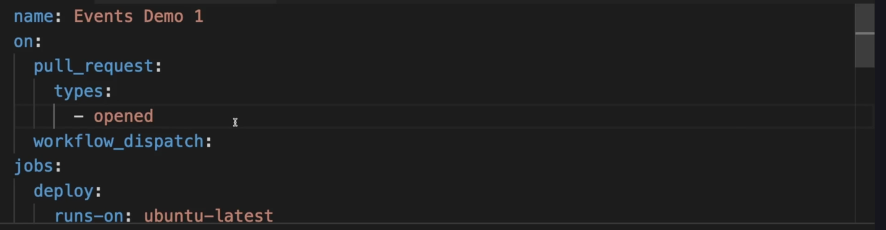

# Event Types and Filter


We cannot always set triggers for push for every activity that happens on repo. There should be set on specific branches like (feature, develop and release) where only develop can trigger build and deploy and feature triggers only build.This is exactly the reason we need event filters.


** Given a scenaio where the workflow triggers only when the pull request is approved **





**Event filters** : When commit is pushed to main branch , then workflow triggers.


```yaml


name: newbuildproject
on:
  push:              
    branches:               #Activity Types
      - master
      - develop
      - feature/*
  pull_request:         #Event Types
    types:
      - opened
    branches:
      - master
      - develop
      - feature/*
  workflow_dispatch:
  paths_ignore:                    # Event filters (these paths will be ignored)
    - 'README.md'
    - '.github/workflows/**'
jobs:
  lint:
    runs-on: ubuntu-latest
    steps:
      - name: Check out repository
        uses: actions/checkout@v2
      - name: Build Project with node 18 version
        uses: actions/setup-node@v3
        with:
          node-version: '18'
      - name: Install dependencies
        run: npm ci
      - name: Run lint
        run: npm run lint
  build:
    needs: lint
    runs-on: ubuntu-latest
    steps:
      - name: Check out repository
        uses: actions/checkout@v3
      - name: Build Project with node 18 version
        uses: actions/setup-node@v2
        with:
          node-version: '18'
      - name: Install dependencies
        run: npm ci
      - name: Run tests
        run: npm test
      - name: Run build
        run: npm run build
  deploy:
    runs-on: ubuntu-latest
    needs: build
    steps:
      - name: Check out repository
        uses: actions/checkout@v3
      - name: Build Project with node 18 version
        uses: actions/setup-node@v2
        with:
          node-version: '18'
      - name: Install dependencies
        run: npm ci
      - name: Deploy to production
        run: echo "Deploying to production..."

```


